<div align="center">

<br><br><br>

# CCM101 - Cloud Computing

## Enterprise Cloud Architect – Operational Manual

<br>

**Project:** Secure Multi-Tier Web Application

**Application Stack:** Nextcloud + MariaDB

**Prepared by:** [Member 1] | [Member 2] | [Member 3] | [Member 4]

**Section:** [Section]

**Instructor:** Jenkielyn C. Torres

**Date:** [Month Year]

</div>

<div style="page-break-after: always;"></div>

## 1. Overview

**VaultCloud** is a private file-sharing cloud built for a client that needs
a secure, automated and recoverable environment. It runs as two linked
containers on an Ubuntu Server virtual machine:

- **Application tier:** Nextcloud (Apache) – the web application
- **Data tier:** MariaDB 10.11 – the database

| Requirement | Where it is met |
|---|---|
| 1 Infrastructure | Section 2 |
| 2 Deployment | Sections 3, 4 |
| 3 Security | Section 5 |
| 4 Automation | Section 6 |
| 5 Documentation | This manual |

## 2. Architecture and Infrastructure

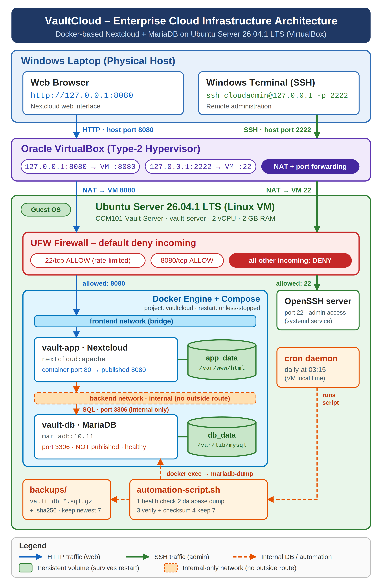

| Item | Value |
|---|---|
| Physical host | Windows laptop |
| Hypervisor | Oracle VirtualBox [version] |
| VM name | CCM101-Vault-Server |
| OS | Ubuntu Server [version, e.g. 26.04.1 LTS] |
| vCPU / RAM / Disk | [2] / [4 GB] / [25 GB] |
| Hostname | vault-server |
| Network mode | NAT + port forwarding |

**Port forwarding (VirtualBox NAT)**

| Host (Windows) | → | VM (Ubuntu) | Purpose |
|---|---|---|---|
| 127.0.0.1:8080 | → | 8080/tcp | Nextcloud web |
| 127.0.0.1:2222 | → | 22/tcp | SSH admin |

**Docker networks and volumes**

| Name | Type | Purpose |
|---|---|---|
| vaultcloud_frontend | bridge | Web traffic to the app |
| vaultcloud_backend | bridge, **internal** | App ↔ database only |
| vaultcloud_db_data | volume | `/var/lib/mysql` |
| vaultcloud_app_data | volume | `/var/www/html` |

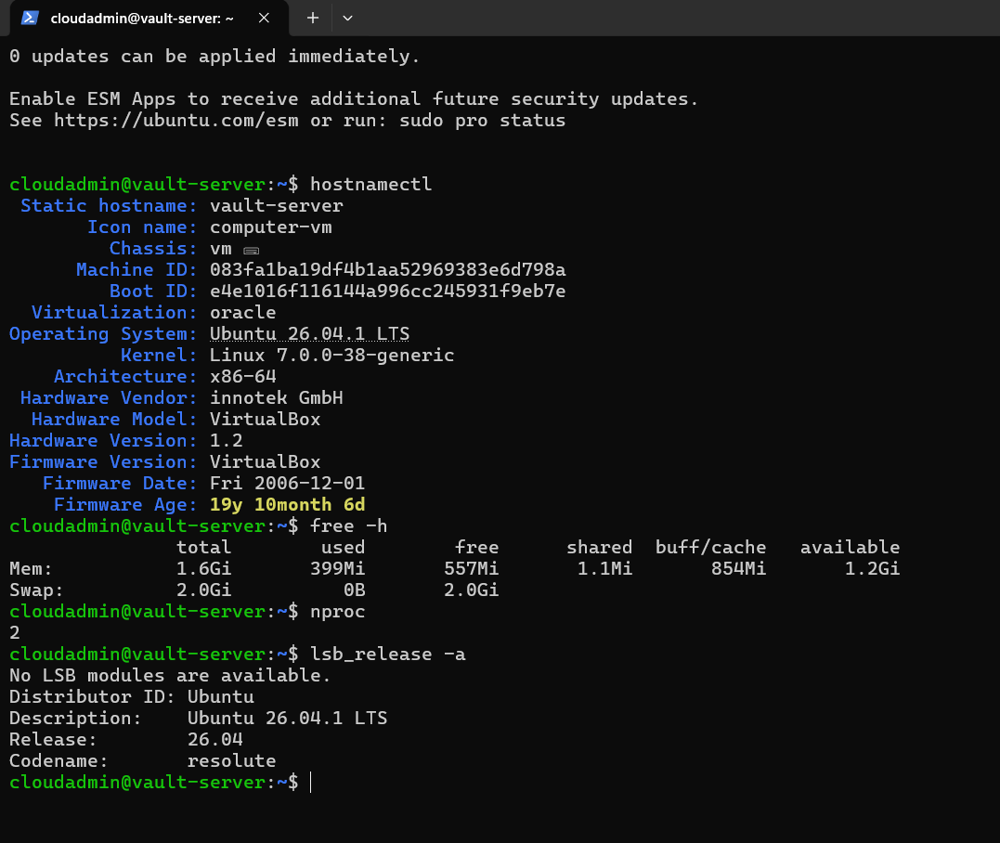

<div style="page-break-after: always;"></div>

## 3. Deployment Procedure

**3.1 Install Docker Engine** (official Docker repository)

```bash
sudo apt update
sudo apt install -y ca-certificates curl
sudo install -m 0755 -d /etc/apt/keyrings
sudo curl -fsSL https://download.docker.com/linux/ubuntu/gpg \
  -o /etc/apt/keyrings/docker.asc
sudo chmod a+r /etc/apt/keyrings/docker.asc
sudo tee /etc/apt/sources.list.d/docker.sources <<EOF
Types: deb
URIs: https://download.docker.com/linux/ubuntu
Suites: $(. /etc/os-release && echo "${UBUNTU_CODENAME:-$VERSION_CODENAME}")
Components: stable
Architectures: $(dpkg --print-architecture)
Signed-By: /etc/apt/keyrings/docker.asc
EOF
sudo apt update
sudo apt install -y docker-ce docker-ce-cli containerd.io \
  docker-buildx-plugin docker-compose-plugin
sudo usermod -aG docker $USER      # log out and in again
```

Verify: `docker --version`, `docker compose version`,
`docker run --rm hello-world`.

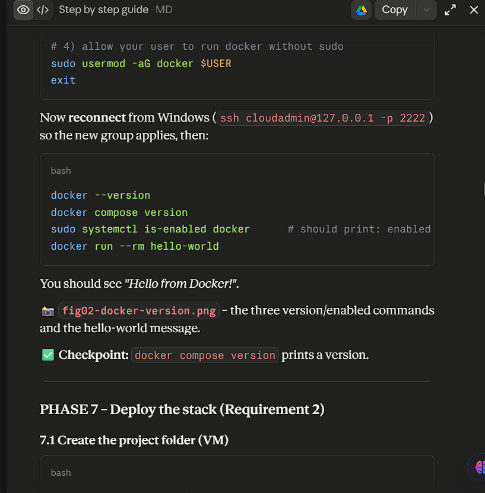

**3.2 Get the code and set the secrets**

```bash
git clone https://github.com/<user>/<repo>.git
cd <repo>/Laboratory-10-Enterprise-Cloud-Architect
cp .env.example .env
nano .env            # change EVERY password
chmod 600 .env
```

**3.3 Start the stack**

```bash
docker compose config -q     # syntax check
docker compose up -d
docker compose ps
```

First start takes 1–3 minutes while Nextcloud installs itself. Open
**http://127.0.0.1:8080** and sign in with `NC_ADMIN_USER`.

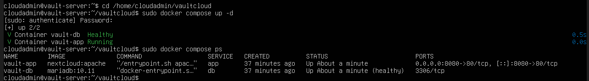

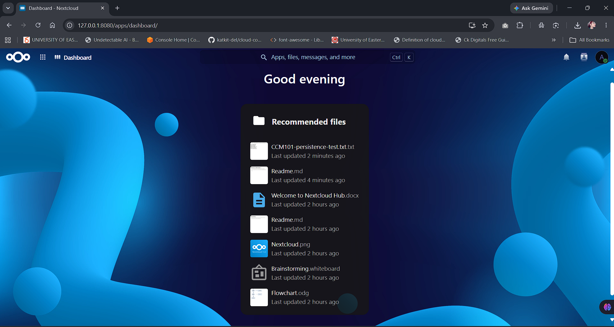

<div style="page-break-after: always;"></div>

## 4. How docker-compose.yml Works

| Setting | Why it is there |
|---|---|
| `image: mariadb:10.11` | Supported long-term-support database |
| `healthcheck` on `db` | Reports *healthy* only when MariaDB accepts connections |
| `depends_on: service_healthy` | App starts only after the database is ready |
| `restart: unless-stopped` | Containers return after a crash or reboot |
| `volumes: db_data, app_data` | Data survives container removal and VM reboot |
| `backend: internal: true` | Database has no route to or from the outside |
| `ports: "8080:80"` (app only) | The single published entry point |
| `${VARIABLES}` from `.env` | No passwords stored in the repository |

**Persistence test (performed):** a test file was uploaded, then
`docker compose down` and `docker compose up -d` were run, then the VM
was rebooted with `sudo reboot`. The file was still present each time.

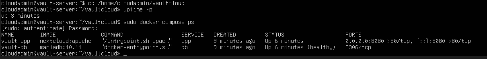

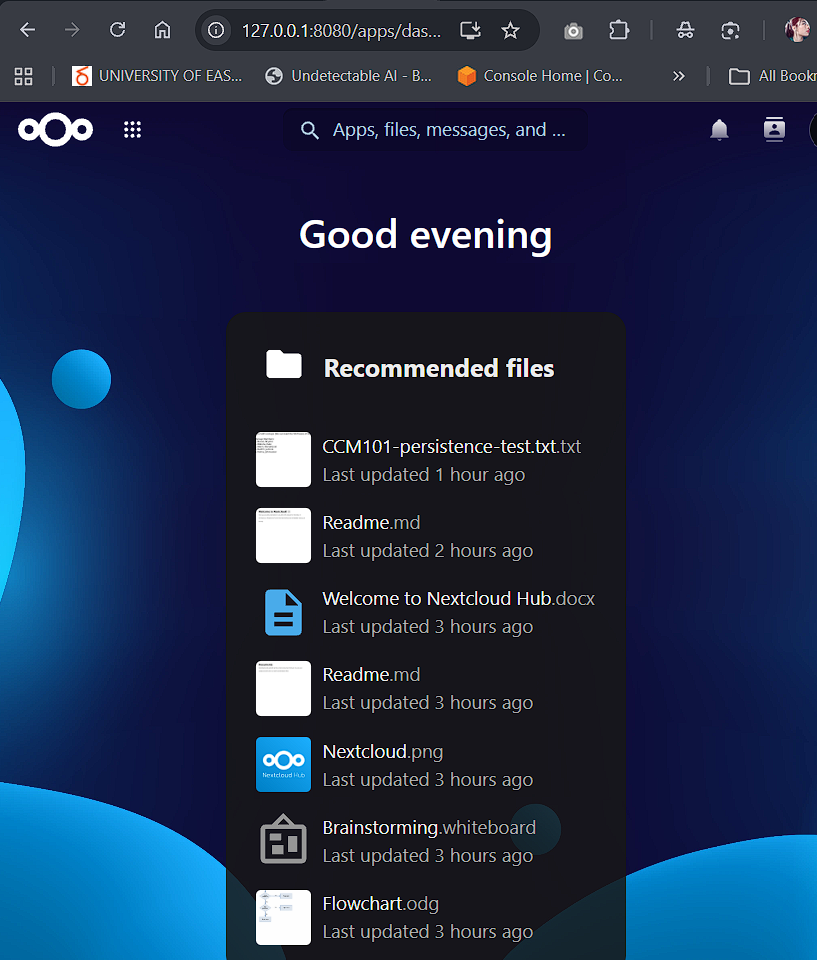

<div style="page-break-after: always;"></div>

## 5. Security Hardening

**5.1 Host firewall (UFW) – default deny**

```bash
sudo ufw default deny incoming
sudo ufw default allow outgoing
sudo ufw limit 22/tcp comment 'SSH admin'
sudo ufw allow 8080/tcp comment 'Nextcloud web'
sudo ufw enable
sudo ufw status verbose
```

Allow SSH **before** enabling the firewall or the session is cut off.
`limit` is an allow rule that also rate-limits repeated SSH attempts.

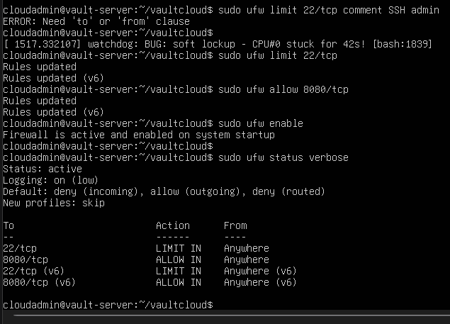

**5.2 Minimal attack surface**

- Only **22** (administration) and **8080** (application) are open.
- MariaDB publishes **no ports** and sits on an **internal** network, so
  only the Nextcloud container can reach it.
- Secrets live in `.env` (mode 600) and are excluded by `.gitignore`.
- Backups are created with permission 600 (owner only).

```bash
sudo ss -tulpn            # only 22 and 8080 should listen
docker port vault-db      # prints nothing
docker network inspect vaultcloud_backend --format '{{.Internal}}'  # true
```

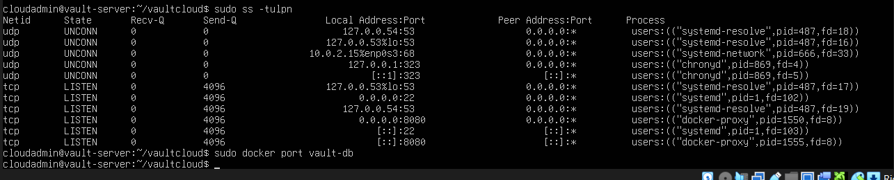

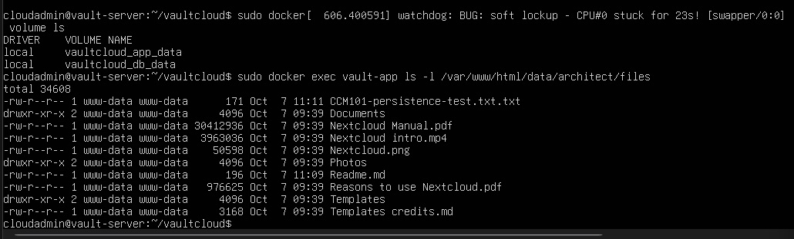

**5.3 Known limitation – Docker and UFW**

Docker writes its own firewall rules for *published* ports, which can
bypass UFW. For that reason this design never publishes the database
port. Further hardening (future work): bind the web port to a specific
address, filter in the `DOCKER-USER` chain, enable HTTPS, use SSH keys
only.

<div style="page-break-after: always;"></div>

## 6. Automation and Disaster Recovery

**Script:** `automation-script.sh` (must be executable:
`chmod +x automation-script.sh`)

| Step | Action |
|---|---|
| 1 | Lock – prevents overlapping runs |
| 2 | Health check – both containers running, DB *healthy* |
| 3 | Disk check – at least 500 MB free |
| 4 | Dump the database, compress to `.sql.gz` |
| 5 | Verify archive (`gzip -t`, tables present), write SHA-256 |
| 6 | Retention – keep the newest 7 backups |

A failed check ends with exit code 1 and a clear `ERROR:` line; a
half-written backup is never kept.

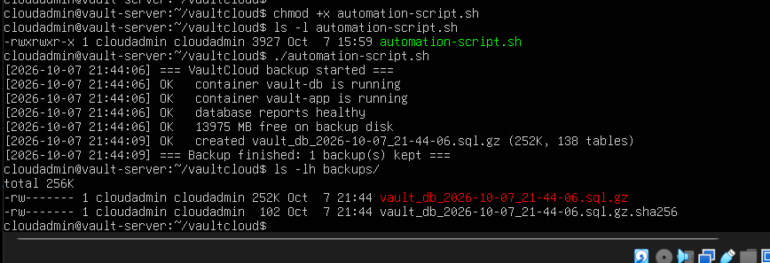

**Schedule (cron) – every day at 3:15 AM**

```bash
crontab -e
15 3 * * * /home/<user>/vaultcloud/automation-script.sh >> /home/<user>/vaultcloud/backups/cron.log 2>&1
```

The cron job was first tested with a temporary every-minute schedule,
then set back to the daily schedule.

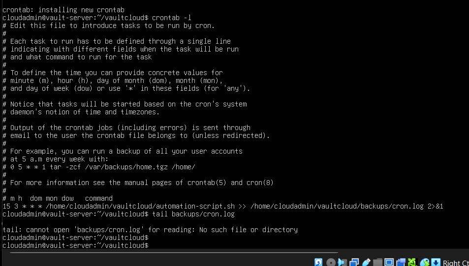

**Verify backups**

```bash
ls -lh backups/
cd backups && sha256sum -c <file>.sha256
zcat <file>.sql.gz | grep -c '^CREATE TABLE'
```

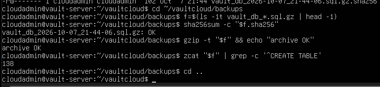

**Restore procedure (disaster recovery)**

```bash
cd ~/vaultcloud
zcat backups/vault_db_<date>.sql.gz | docker exec -i vault-db sh -c \
  'exec mariadb -uroot -p"$MARIADB_ROOT_PASSWORD" "$MARIADB_DATABASE"'
docker compose restart app
```

<div style="page-break-after: always;"></div>

## 7. Daily Operations Cheat Sheet

| Task | Command |
|---|---|
| Status | `docker compose ps` |
| Start | `docker compose up -d` |
| Stop (keeps data) | `docker compose down` |
| Live logs | `docker compose logs -f app` |
| Manual backup | `./automation-script.sh` |
| List backups | `ls -lh backups/` |
| Firewall status | `sudo ufw status verbose` |
| Cron jobs | `crontab -l` |
| App status | `docker exec -u www-data vault-app php occ status` |

> **Warning:** never run `docker compose down -v` in normal operation.
> `-v` deletes the volumes, which destroys all data.

## 8. Maintenance

- **Weekly:** check `backups/cron.log` for `ERROR`; confirm 7 backups.
- **Monthly:** `sudo apt update && sudo apt upgrade`, then reboot and
  confirm `docker compose ps` shows both services up.
- **Updating containers:**
  `docker compose pull && docker compose up -d` – run a manual backup
  first.
- **Disk:** `df -h` – keep at least 20% free.
- **Secrets:** change passwords in `.env` and in Nextcloud if a member
  leaves the team.

## 9. Troubleshooting

| Symptom | Check / fix |
|---|---|
| Browser: "untrusted domain" | Add the address to `NC_TRUSTED_DOMAINS` or run `occ config:system:set trusted_domains 2 --value=<host>` |
| Page not loading | `docker compose ps`; wait for db *healthy* |
| `permission denied` on docker | Log out and in after `usermod -aG docker` |
| Script: permission denied | `chmod +x automation-script.sh` |
| Script: `bad interpreter` | Windows line endings: `sed -i 's/\r$//' automation-script.sh` |
| SSH refused | `sudo ufw status` – port 22 must be allowed |
| No backups at 3:15 | `systemctl status cron`; read `backups/cron.log` |

<div style="page-break-after: always;"></div>

## 10. Rapid Redeploy on a Fresh Environment (KillerCoda)

```bash
docker --version || curl -fsSL https://get.docker.com | sh
git clone https://github.com/<user>/<repo>.git
cd <repo>/Laboratory-10-Enterprise-Cloud-Architect
cp .env.example .env && nano .env
docker compose up -d
chmod +x automation-script.sh && ./automation-script.sh
```

Open the environment's **Traffic / Ports** menu for port 8080. If the
site reports an untrusted domain, add that hostname with the `occ`
command from Section 9.

## 11. Source Control

All code and documentation are committed to the repository folder
`Laboratory-10-Enterprise-Cloud-Architect`.

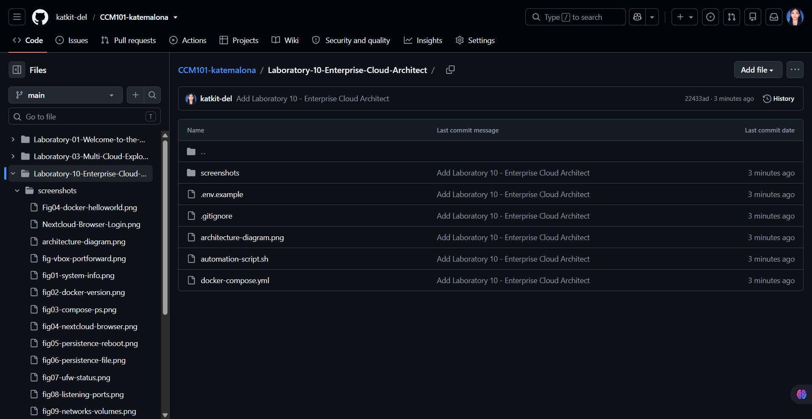

## 12. References and AI Disclosure

- Docker Engine installation for Ubuntu – docs.docker.com
- Nextcloud Docker image and MariaDB settings – hub.docker.com/_/nextcloud
- Ubuntu Server – ubuntu.com/download/server
- Docker and UFW – docs.docker.com/engine/network/packet-filtering-firewalls

**AI assistance:** [Write truthfully which AI tools were used and for
what, e.g. explanations, troubleshooting and drafting. State what the
group configured, ran and verified itself.]
